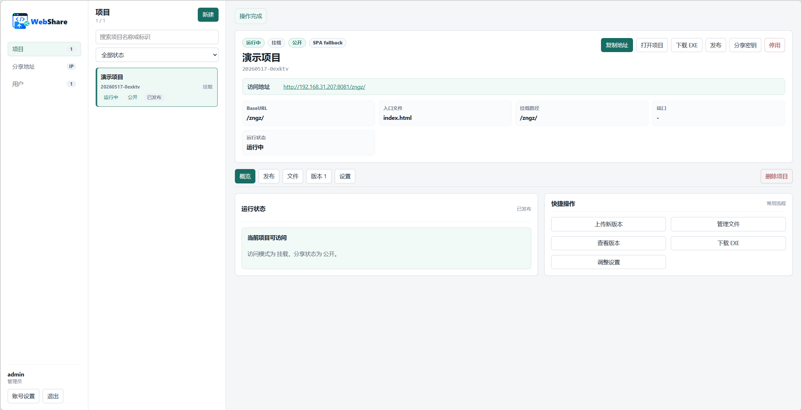
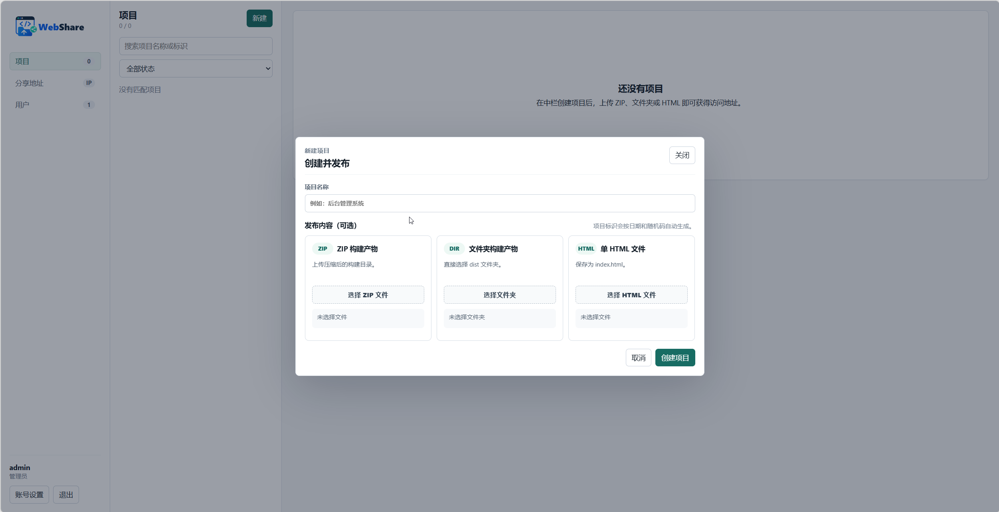

# WebShare

文件功能描述：概述 WebShare 的项目定位、核心能力和文档入口。

## 项目意义

大模型的发展正在改变静态页面的生产方式：单个 HTML、临时演示页、一次性原型和小型前端产物的生产越来越简单，数量也越来越多。它们通常不值得单独部署一套完整服务，但又需要在团队、教室、展厅或办公室局域网内快速打开、预览和分享。

WebShare 面向这种局域网环境，提供静态页面的快捷托管、分享和管理能力。用户可以把单 HTML、文件夹或 ZIP 构建产物上传到本机服务，由系统生成局域网访问地址，并根据页面资源路径选择分享网关、挂载路径或独立端口访问方式。

## 产品特性

- 多账号管理：支持管理员和普通用户角色，普通用户只管理自己的托管项目，管理员可以统一维护用户、分享地址和项目状态。
- 分享密钥保护：项目可以生成 6 位分享密钥，支持通过 `?key=` 链接访问，也支持在分享页面手动输入密钥，适合在局域网内做轻量访问控制。
- 发布流程简单：支持上传单 HTML、文件夹或 ZIP 构建产物，系统会自动识别入口文件、分析 BaseURL 和资源路径，并给出访问方式建议。
- 路径兼容能力：支持 `/p/{slug}/` 分享、固定挂载路径和独立端口模式；对依赖根路径 `/` 的项目可自动分配端口，对前端路由项目可启用 SPA fallback。
- WebUI 全流程管理：项目创建、上传发布、启停、回滚、分享密钥、访问地址和用户管理都可以在管理后台完成，不要求使用者操作命令行。
- 局域网分享友好：管理员可以在后台检测和选择本机局域网地址，访问链接会按当前主机、分享端口或项目独立端口自动生成。
- 版本可回滚：每次上传都会形成项目版本，可查看版本信息并回滚到历史版本，适合演示页、课程材料和临时原型的快速迭代。
- Windows 单 EXE 交付：主程序可作为 Windows 单 EXE 双击运行，也支持把已托管项目打包成独立 EXE 进行离线分享。项目 EXE 能力不建议用于正式分发，因为证书签名问题无法由应用侧完全解决，容易被浏览器、系统、安全软件、IM 或邮件传输环节拦截。

## 界面预览

发布完成后，管理后台会展示项目运行状态、访问地址、BaseURL、挂载路径和常用操作。

创建项目时可以直接选择 ZIP、文件夹或单 HTML 文件上传，完成创建后即可获得访问地址。

## 核心能力

- 支持单 HTML、文件夹和 ZIP 发布。
- 支持项目启用、停用、版本管理和回滚。
- 支持普通用户项目隔离，管理员管理用户和分享地址。
- 支持 `/p/{slug}/` 分享、固定挂载路径和项目独立端口。
- 支持 Windows 单 EXE 交付，并可为已发布项目生成独立运行 EXE。

## 获取与部署

- Windows 用户可以打开 [GitHub Releases](https://github.com/LLMxPM/WebShare/releases)，下载最新的 `WebShare-<version>-windows-amd64.zip`，解压后运行 `webshare.exe`。
- Docker 部署可以直接使用 `llmxpm/webshare:latest` 镜像，或使用仓库中的 `docker-compose.yml`。
- 本地开发和源码运行请参考 [开发文档](docs/development.md)；生产部署、端口和环境变量请参考 [部署文档](docs/deployment.md)。

## 文档

- [开发文档](docs/development.md)：本地开发、项目结构、构建测试和代码约定。
- [部署文档](docs/deployment.md)：容器部署、Windows 单 EXE 交付、端口和环境变量。
- [CI/CD 自动发布](docs/ci-cd.md)：GitHub Actions、Release 和 Docker Hub 推送配置。
- [使用文档](docs/usage.md)：登录、发布项目、分享地址、版本管理和常见路径选择。

## 许可证

本项目使用 [Apache License 2.0](LICENSE) 开源协议。
