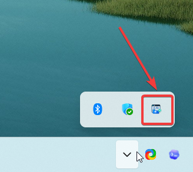
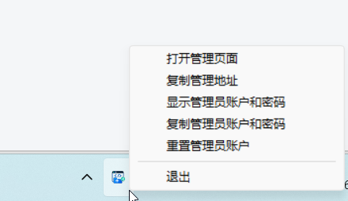

# 部署文档

文件功能描述：说明 WebShare 的部署方式、端口模型、环境变量和 Windows 单 EXE 交付流程。

## 部署形态

WebShare 支持三种常见部署方式：

- Release 软件包：适合 Windows 用户直接下载单 EXE 并双击运行。
- Docker Compose：适合固定服务器或小型局域网主机。
- 源码自行构建：适合需要定制、验证或手动打包发布产物的场景。

Windows 用户可以打开 [GitHub Releases](https://github.com/LLMxPM/WebShare/releases)，下载最新的 `WebShare-<version>-windows-amd64.zip`，解压后运行 `webshare.exe`。源码本地运行更适合开发调试，见 [开发文档](development.md)。

## 端口模型

- `8080`：管理后台和 API，默认访问 `http://localhost:8080/admin/`。
- `8081`：分享网关，提供 `/p/{slug}/` 和自定义挂载路径。
- `12000-12999`：项目独立端口池，用于兼容依赖 `/` 根路径的前端产物。

系统不依赖域名或子域名。局域网环境下，优先通过本机 IP 和端口生成访问地址。

## Docker 部署

Docker Hub 镜像仓库为 `llmxpm/webshare`。发布流程会推送 `latest`、版本号和 `sha-<commit>` 标签；常规部署建议使用 `latest` 或明确的版本号标签。

### Docker Run

拉取最新镜像：

```bash
docker pull llmxpm/webshare:latest
```

启动容器：

```bash
docker run -d --name webshare \
  --restart unless-stopped \
  -p 8080:8080 \
  -p 8081:8081 \
  -p 12000-12999:12000-12999 \
  -v webshare-data:/data \
  -e PUBLIC_HOST=192.168.1.10 \
  -e PUBLIC_SCHEME=http \
  llmxpm/webshare:latest
```

将 `PUBLIC_HOST` 改为宿主机在局域网内可访问的 IP 或主机名。只在本机测试时可以临时使用 `localhost`，但局域网设备无法通过 `localhost` 访问宿主机服务。

### Docker Compose

仓库根目录的 [docker-compose.yml](../docker-compose.yml) 是默认部署文件，直接使用 `llmxpm/webshare:latest` 镜像。使用前先修改 `PUBLIC_HOST`，将它改为宿主机在局域网内可访问的 IP 或主机名。

```bash
docker compose pull
docker compose up -d
```

如果需要从源码本地构建镜像，可以使用 [docker-compose.dev.yml](../docker-compose.dev.yml)：

```bash
docker compose -f docker-compose.dev.yml up --build -d
```

默认端口映射为：

```text
8080:8080
8081:8081
12000-12999:12000-12999
```

默认数据卷为 `webshare-data`，容器内数据目录为 `/data`。如果不需要独立端口模式，可以只暴露 `8080` 和 `8081`，但根路径 `/` base 的项目兼容性会下降。

Docker 场景默认同时输出日志到容器标准输出和 `/data/logs/webshare.log`。常用查看方式：

```bash
docker compose logs -f webshare
docker compose exec webshare tail -f /data/logs/webshare.log
```

使用 `docker run` 启动时，对应命令为：

```bash
docker logs -f webshare
docker exec webshare tail -f /data/logs/webshare.log
```

## Windows 单 EXE 交付

日常使用建议优先从 [GitHub Releases](https://github.com/LLMxPM/WebShare/releases) 下载 Windows 软件包。下面的构建命令仅用于需要从源码自行打包时。

构建命令：

```bash
pnpm --dir web build
mkdir -p internal/runnerstub release
CGO_ENABLED=0 GOOS=windows GOARCH=amd64 go build -ldflags="-H windowsgui" -o release/webshare-runner-windows-amd64.exe ./cmd/webshare-runner
cp release/webshare-runner-windows-amd64.exe internal/runnerstub/webshare-runner-windows-amd64.exe
CGO_ENABLED=0 GOOS=windows GOARCH=amd64 go build -tags embedrunner -ldflags="-H windowsgui" -o release/webshare.exe ./cmd/webshare
```

生成文件：

```text
release/webshare.exe
release/webshare-runner-windows-amd64.exe
```

交付时只需要发送 `release/webshare.exe`；`release/webshare-runner-windows-amd64.exe` 是用于构建内嵌壳程序的输出文件。用户双击后，程序会进入 Windows 系统托盘，自动打开管理后台，并在 exe 所在目录生成 `data/` 目录保存数据库和上传项目。

Windows 单 EXE 默认不打开控制台，运行日志写入 exe 同级目录下的 `data/logs/webshare.log`。

程序运行后会常驻系统托盘。如果图标被 Windows 收纳到隐藏区域，可以在托盘展开面板中找到 WebShare 图标。



右键托盘图标可以打开管理页面、复制地址、查看或重置管理员账号，也可以退出程序。



托盘菜单提供：

- 打开管理页面。
- 复制管理地址。
- 显示管理员账户和密码。
- 复制管理员账户和密码。
- 重置管理员账户。
- 退出。

## 主要环境变量

| 变量 | 默认值 | 说明 |
|---|---:|---|
| `DATA_DIR` | `data` | SQLite 和项目文件目录 |
| `ADMIN_ADDR` | `:8080` | 管理服务监听地址 |
| `SHARE_ADDR` | `:8081` | 分享网关监听地址 |
| `PUBLIC_HOST` | 自动检测 | 生成访问地址使用的主机或 IP，默认取第一个局域网 IPv4，失败时回退 `localhost` |
| `PUBLIC_SCHEME` | `http` | 生成访问地址使用的协议 |
| `PORT_START` | `12000` | 独立端口池起始端口 |
| `PORT_END` | `12999` | 独立端口池结束端口 |
| `MAX_UPLOAD_MB` | `300` | 上传文件大小限制 |
| `INIT_ADMIN_USER` | `admin` | 首次启动管理员用户名 |
| `INIT_ADMIN_PASSWORD` | 空 | 首次启动管理员密码 |
| `RUNNER_STUB_PATH` | `release/webshare-runner-windows-amd64.exe` | 下载项目 EXE 时使用的预编译 Windows 壳程序 |
| `LOG_FILE` | `<DATA_DIR>/logs/webshare.log` | 运行日志文件路径 |
| `LOG_STDOUT` | Linux/Docker 为 `true`，Windows 为 `false` | 是否同时输出到标准输出 |
| `LOG_MAX_SIZE_MB` | `10` | 单个日志文件最大体积 MB |
| `LOG_MAX_BACKUPS` | `5` | 保留的旧日志文件数量 |
| `LOG_MAX_AGE_DAYS` | `30` | 旧日志文件保留天数 |

## 初始管理员

首次启动时，如果数据库中没有用户，系统会创建管理员账号。可以通过环境变量指定账号和密码：

```yaml
environment:
  INIT_ADMIN_USER: admin
  INIT_ADMIN_PASSWORD: change-me-123
```

使用 `docker run` 时，可以追加：

```bash
-e INIT_ADMIN_USER=admin \
-e INIT_ADMIN_PASSWORD=change-me-123
```

如果没有设置 `INIT_ADMIN_PASSWORD`，服务会在空库首次启动时把一次性初始密码写入运行日志。Windows 单 EXE 模式下，也可以通过托盘菜单查看或重置管理员账号。

Docker 部署后如果忘记管理员密码，可以在运行中的容器内执行离线重置命令：

```bash
docker exec webshare /app/webshare admin reset-password
```

如果容器当前没有运行，也可以通过 Compose 使用同一个数据卷临时执行：

```bash
docker compose run --rm webshare admin reset-password
```

命令会把默认管理员账号重置为 `INIT_ADMIN_USER` 指定的用户名（默认 `admin`），生成新密码并打印到终端，同时更新数据库中的密码哈希和可展示的明文凭据记录。

## 局域网访问注意事项

- 确保防火墙允许管理端口、分享端口和需要使用的独立端口。
- 多网卡机器应在管理后台的“分享地址”页面选择正确的局域网 IP。
- 如果项目使用独立端口访问，需要同时开放对应端口池。
- 使用 Docker 部署时，`PUBLIC_HOST` 建议设置为宿主机局域网 IP，而不是容器内地址。
